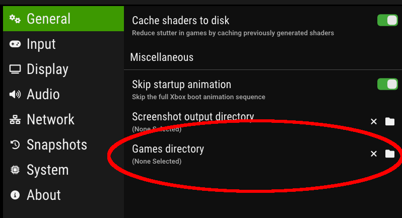
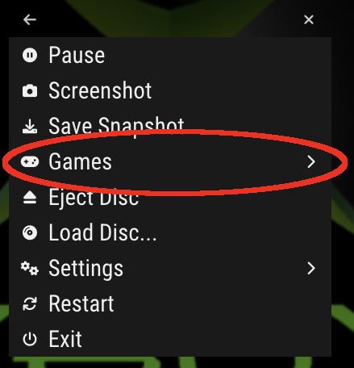

xemu provides a basic game selector that may be used to change the running title
with a controller.

## Setup

The directory containing the xiso files to be included in the game selector must
be configured in xemu's "General" settings prior to use.

Click on the "Games directory" setting to modify it.

## Use

From the xemu popup menu (by default this may be opened by pressing F2 or using
the guide button on a controller), select "Games", then select the desired title
from the list.

