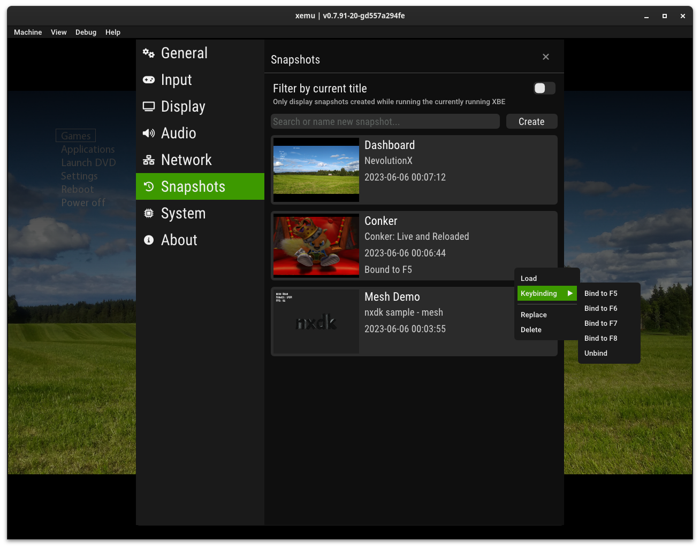
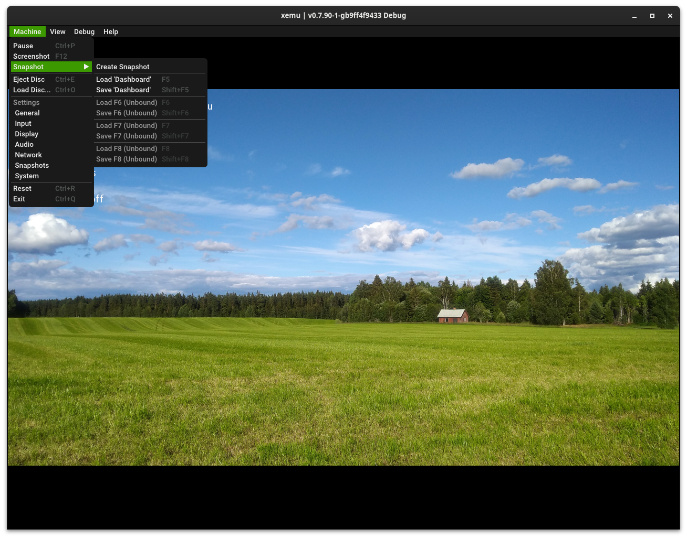

**Snapshots**, also often called *Save States*, are a representation of the entire machine state which can be saved or restored at any time. With snapshots you can virtually eliminate the need to rely on in-game checkpoints to save your progress. Save a snapshot, and load it up again later and it's as if you had just kept on playing.

!!! warning

	Please be aware that snapshots are a brand new feature. While this feature works reliably in my testing, there may be some bugs. There are some caveats to be aware of.

## About Snapshots

Snapshots are saved to the hard disk image that you started xemu with.

!!! danger "Important Notes"

	Before restoring a snapshot, you should:

	* **Load your game disc image as normal.** Loading a snapshot will not re-mount the game disc, so if you load a snapshot and the game then tries to read from disc, it will fail. Launch xemu, load your game disc, then restore the snapshot.

	* **Connect controllers to match the saved configuration.** For instance: if there was a controller connected to Port 1 when the snapshot was created, make sure there is a controller connected to Port 1 before loading the snapshot. If this configuration does not match, an error message will be displayed and the machine will be paused. Simply connect the appropriate controllers, load the snapshot again, and enter `cont` in the monitor to continue).

## Using the UI

The snapshots interface is available in the settings menu, available under <kbd>Machine</kbd> &rarr; <kbd>Snapshots</kbd>.

From here, snapshots can be filtered either by the current title, or game, being played, or by entering part of the snapshot name.
In addition, snapshots can be created with the creation field.

The snapshot list shows each snapshot, along with some information, in descending order of most recent creation date.

Snapshots can be:

* **Restored** by clicking on its snapshot button
* **Deleted** by clicking the delete button on the right
* **Saved** by clicking the save (floppy disc) icon
* **Bound** to to one of the <kbd>F5</kbd>, <kbd>F6</kbd>, <kbd>F7</kbd>, or <kbd>F8</kbd> keys by clicking the keyboard button

!!! info "Bound Snapshots"

	When bound, pressing the corresponding <kbd>F#</kbd> key will load the snapshot at any time.
	Pressing <kbd>Shift</kbd> + <kbd>F#</kbd> will save over the snapshot.
	These keys will have no effect when no snapshot is bound to them, so you must first bind a snapshot before you can use them.

For quick access, snapshots can also be created directly from the <kbd>Machine</kbd> &rarr; <kbd>Snapshot</kbd> submenu.
Keyboard-bound snapshots can also be saved or loaded from this menu.

Snapshots can also be created from the pop-up menu, and the pop-up menu has a quick-access button to enter the snapshots settings page.

## Using the Monitor

After you have launched your game in xemu, open the Monitor window by navigating to <kbd>Debug</kbd> &rarr; <kbd>Monitor</kbd>.

* **Save a snapshot:**  Enter the command `savevm my-snapshot`, where `my-snapshot` is a name you can give to this snapshot
* **List snapshots:** Enter the command `info snapshots`
* **Restore a snapshot:** Enter the command `loadvm my-snapshot`
* **Delete a snapshot:** Enter the command `delvm my-snapshot`
